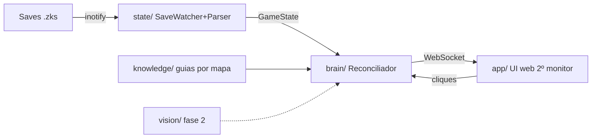

# Couch Buddy — Rogue Trader Companion (design)

Data: 2026-07-20 · Status: aprovado (abordagem e seção 1 pelo usuário; demais decisões delegadas)

## Problema

Rafael joga Warhammer 40,000: Rogue Trader (Steam/Proton, nesta máquina Linux, X11, 3 monitores) e quer, num segundo monitor, uma tela que mostre **tudo que há para fazer no mapa atual** — itens (inclusive escondidos), interações, quests, decisões com consequência e dicas de combate — na **ordem sugerida por walkthroughs completos**, atualizando **sozinha** conforme ele joga. Critérios: não perder nada importante, não dar alt+tab, não precisar dizer ao sistema onde está.

Estado do jogador: save no Ato 2 (`Chapter: 2`), personagem Lazarus rank 27, última área "Administratum" (Dargonus), Footfall/Janus/Forge world já visitados.

## Abordagem escolhida (A): save-file primeiro, visão como complemento

O jogo autosava em transições de área e os saves (`.zks`) são ZIP com JSON aberto. Um watcher parseia cada save novo e obtém **verdade absoluta**: área atual, capítulo, estado de 370 quests/objetivos, inventário. A checklist do mapa se pré-marca sozinha. Visão computacional (captura do monitor do jogo) fica para a fase 2, cobrindo a janela entre autosaves.

Alternativas rejeitadas: visão contínua como fonte primária (custo de API contínuo, incerteza sobre inventário) e modo manual (viola o requisito "automaticamente").

## Arquitetura

### `state/` — SaveWatcher + parser

- Observa `.../Saved Games/` (prefixo Proton, appid 2186680) via inotify (watchdog); debounce até o `.zks` estabilizar.
- Extrai do ZIP apenas `header.json` e `player.json` (sem descompactar o resto; saves têm ~10MB).
- `GameState`: `area_guid`, `area_name` (ver mapeamento abaixo), `chapter`, `quests[{blueprint_guid, state, objectives[]}]`, `save_id`, `game_id`, `timestamp`. Inventário entra quando o parser de blueprints permitir nomear itens (ver riscos).
- **Mapeamento GUID→nome de área**: derivado dos próprios filenames do save (`<guid><NomeDaCena>_Mechanics.json`), acumulado em `data/games/rogue-trader/guid_map.json`; complementado pelo dump de blueprints se disponível; último recurso: UI pergunta uma vez e aprende.

### `knowledge/` — guias estruturados por mapa

- Pipeline offline (build time, não runtime): scraping de walkthroughs (Fextralife, Neoseeker, guias Steam; BrightData se bloqueado) → curadoria por LLM → um JSON por mapa validado por schema Pydantic.
- Schema `MapGuide`: `area_name`, `aliases`, `act`, `sources[]`, `steps[{order, type: item|interaction|quest_step|decision|combat_tip, title, details, quest, missable, spoiler, source_url}]` — ordenados na ordem sugerida de execução.
- Brutos em `data/games/rogue-trader/raw/` (gitignored); curados em `data/games/rogue-trader/maps/` (versionados).
- Casamento mapa↔save por `area_name`/`aliases` contra o nome derivado do GUID.
- ChromaDB para Q&A livre fica para a fase 3 (fora do MVP).

### `brain/` — Reconciliador

- Junta `GameState` + `MapGuide` da área atual + progresso manual (`data/progress/<game_id>.json`).
- Auto-marca: quest steps cujo estado no save é `Completed`; (fase 1b, se blueprints decodificados) itens presentes no inventário.
- Sem chamadas de API no loop normal. LLM só no pipeline offline e na fase 2 (visão).

### `app/` — servidor + UI

- FastAPI + WebSocket em `localhost:8017`; página única (vanilla JS, tema escuro, layout para ultrawide 2560×1080).
- Mostra: cabeçalho com mapa atual/capítulo · checklist ordenada com badges por tipo · alertas `missable`/`decision` destacados · seção de quests do mapa · dicas de combate colapsáveis; spoiler `high` desfocado até hover.
- Clique marca/desmarca passo; persiste por campanha (`game_id`). Push instantâneo quando chega save novo.
- Launcher `couch-buddy` (script/entry point) sobe servidor e abre Chrome no 2º monitor (`--window-position`).

### `vision/` — fase 2 (fora do MVP)

- mss captura o monitor do jogo (X11) a cada ~12s; Haiku 4.5 classifica mapa/contexto entre autosaves; Sonnet 5 apenas em consultas pontuais. Modelos na config atualizados para a família atual.

## Tratamento de erros

- Save corrompido/parse falho → mantém último estado, loga, UI mostra timestamp do último sync.
- GUID de área desconhecido → banner na UI pede o nome (uma vez), grava em `guid_map.json`.
- Mapa sem guia → UI diz "sem guia para esta área" + lista quests do save mesmo assim.
- Watcher cai → systemd/`--restart` simples; MVP roda em foreground com log.

## Testes

- Parsers (`.zks`, quest book, guid_map): pytest com fixtures extraídas dos 79 saves reais existentes (só os JSONs necessários, não o ZIP inteiro).
- Schema `MapGuide`: validação Pydantic de todos os JSONs curados no CI local (`pytest` + hook no pipeline de ingestão).
- Reconciliador: casos de casamento área↔guia (nome exato, alias, desconhecido).
- UI: teste de fumaça (server sobe, `/` responde, WebSocket entrega estado).

## Fases

1. **MVP (agora)**: SaveWatcher + parser, guid_map por filenames, reconciliador, UI web, launcher, knowledge do Ato 2 (Footfall + Dargonus + Janus + demais mapas do ato).
2. Visão entre autosaves + auto-check de itens via blueprints decodificados.
3. Ingestão dos Atos 3–5, ChromaDB/Q&A, dicas de build.

## Riscos

- **Blueprints (`blueprints-pack.bbp`)**: formato proprietário (tabela GUID+offset já decifrada; payload ainda não). Se não ceder, MVP segue sem auto-check de itens (clique manual cobre) e quests casam por área, não por GUID.
- **Cobertura dos walkthroughs**: mitigada cruzando ≥2 fontes por mapa e mantendo `source_url` por passo para auditoria.
- **Autosave só em transição**: dentro de um mapa longo o estado do save defasa; mitigação = cliques manuais (MVP) e visão (fase 2).
